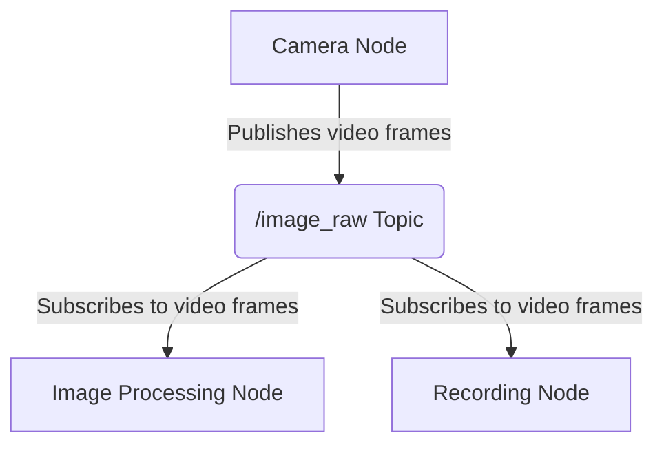

# 1. Communication Basics: The ROS 2 Graph

Welcome to the foundational chapter of our journey into the Robotic Nervous System. Before we can make a robot move or think, we need to understand how its different software components communicate with each other. In ROS 2, this communication network is called the **ROS Graph**.

The ROS Graph is a peer-to-peer network of processes that are all working together. The three most important concepts you need to understand are Nodes, Topics, and Services.

## Nodes: The Brain Cells

A **Node** is the smallest unit of computation in ROS 2. Think of it as a single, dedicated program responsible for one specific task. For example, you might have:

- A `camera_node` that reads data from a physical camera.
- A `motor_controller_node` that sends commands to the robot's wheels.
- An `obstacle_detection_node` that processes sensor data to find obstacles.

Each node in your system is an independent executable. They can be written in different programming languages (like Python or C++) and can run on different computers, but they can still communicate with each other seamlessly.

## Topics: The Nerve Pathways

**Topics** are the primary way that nodes exchange data. A topic is essentially a named "bus" or "channel" where a node can publish messages. Other nodes can then subscribe to that topic to receive those messages.

- **Publishers**: A node that sends messages to a topic is called a publisher.
- **Subscribers**: A node that receives messages from a topic is called a subscriber.

This **publish/subscriber** (or "pub/sub") model is powerful because it decouples the nodes from each other. The `camera_node` doesn't need to know or care if zero, one, or twenty other nodes are listening to its video stream. It just publishes the data to the `/image_raw` topic.

This one-to-many communication is perfect for continuous data streams, like sensor readings, camera feeds, or robot state information.

Here is a simple diagram illustrating the concept:

## Services: The Direct Questions

While topics are great for continuous streams of data, sometimes a node needs to ask another node a direct question and get a direct answer. This is what **Services** are for.

A service is a request/response communication model. It works like a remote procedure call (RPC).

- **Service Server**: One node acts as a "server" that provides a service. It waits for a request, performs a task, and sends back a response.
- **Service Client**: Another node acts as a "client" that calls the service, sends a request, waits for the response, and then continues its work.

Unlike topics, this is a one-to-one communication that is synchronous (the client waits for the response). Services are best for discrete actions or queries, such as:

- Requesting to spawn a new robot model in a simulation.
- Asking a navigation node to compute a path to a specific location.
- Triggering a robot arm to move to a predefined "home" position.

By combining Nodes, Topics, and Services, you can build complex, robust, and scalable robotics applications. In the next chapters, we'll put these concepts into practice.
